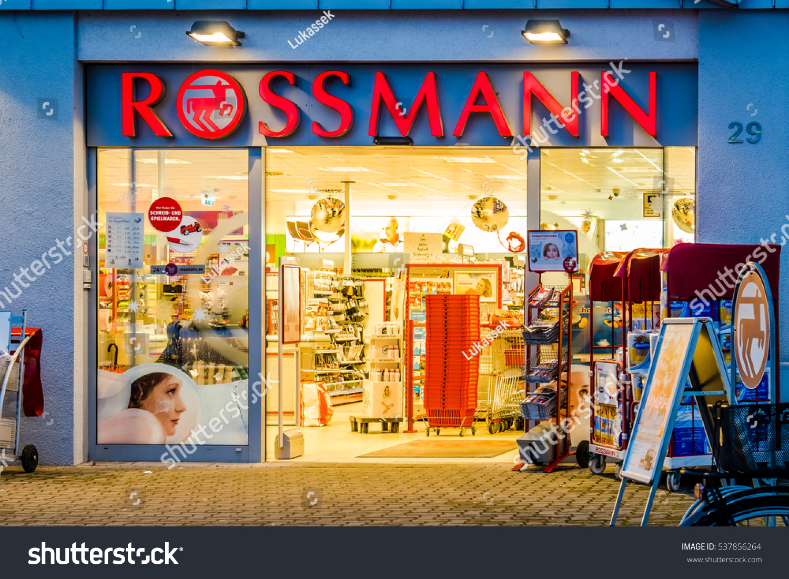

# Sales Analyzing and Weekly Sales Forecasting for Drug Store Rossmann

# Capstone Project III
### Problem Statement: 
This project looks into what kind of insights can the drug store Rossmann gain from their historical sales, promotion,  school/state holidays and competitors data. Also it looks into how they can use them to optimize the store operation and management in order to generate more sales revenue. Plus how can they use these data sets to forecast the weekly sales for each store with a certain level of accuracy? 

### Background:
Rossmann operates over 3,000 drug stores in 7 European countries. Currently, Rossmann store managers are tasked with predicting their weekly sales for up to eight weeks in advance. Store sales are influenced by many factors, including promotions, competition, school and state holidays, seasonality, and locality. With thousands of individual managers predicting sales based on their unique circumstances, the accuracy of results can be quite varied. Therefore the company’s data science team is on a new mission to create a unified modeling method for managers to forecast the weekly results with higher accuracy. The management team also required an overall report with feasible strategies for the company to understand the general performance of all stores and to come up with a way to optimize future sales performance. Lastly an individual store performance report needs to be provided to each store manager. 

### Data Source:
The datasets used in this study are sourced from https://www.kaggle.com/c/rossmann-store-sales/data and consists of two datasets: 
train.csv, store.csv:
- train.csv containing 1,017,209 data samples, is composed of a total of 9 variables collected from 1115 Rossmann stores over 942 days from 01/01/2013 to 07/31/2015, with 7 numerical variables and 2 categorical variables. 
- store.csv containing 1115 data samples, is composed of a total of 10 variables collected from 1115 Rossmann stores, with 6 numerical variables and 3 categorical variables. 

### Objective:
-	Explore and analyze historical sales related data for Rossmann. 
-	Identify the key factors that influence store sales.
-	Provide overall sales performance report to the management team with feasible strategies to increase future sales.  
-	Provide individual store performance report to each store manager.
-	Develop time series model that predict the future sales for each store with certain level of accuracy.  

### Significance 
- By analyzing the historical sales related data, we will identify the main factors that influence store sales, identify key sales drivers among 1115 stores that are categorized into 4 different store types and 3 different assortment types. 
- Diagnose the key issues that are negatively impacting sales growth. Advising management team with feasible business strategy based on the analyze results. 
- In respect of providing individual report to each store manager, we will create an online interactive dashboard for them to track the historical sales related data of their store or of any other stores. Data and graphs will be automated for consistent and automatic delivery on a daily, weekly or monthly basis. Future 8 weeks’ sales forecast for each store will also be provided with 95% confidence interval. By bringing individual store data together in an organization dashboard, we can provide a more integrated and concise view for the sales of each store, ensuring the managers know where their store stand and where the store is based on goals set.

### Reports
1. [Capstone Project III Project Proposal](https://github.com/yoyo6022/Sales-Analyzing-and-Weekly-Sales-Forecasting-for-Drug-Store-Rossmann/blob/master/report/Yang_Liu_Kunz_Capstone_3_Project%20Proposal.pdf)
2. [Jupyternotebook](https://github.com/yoyo6022/Sales-Analyzing-and-Weekly-Sales-Forecasting-for-Drug-Store-Rossmann/tree/master/Notebook)
3. [Interactive Dashboard](https://rossmannsalesdash.herokuapp.com/)
3. [Capstone Project III Final Report]() : 
4. [Capstone Project III Final Presentation]()
